# Introduction

## Use of LLMs in NASA’s Science Mission Directorate

### Motivation

From a scientific perspective, the motivation behind leveraging large language models (LLMs) in research workflows is rooted in efficiency and the acceleration of discovery. Using these advanced models promises to significantly save scientists' time by streamlining research processes such as data and information discovery, access, literature reviews, and the writing or modification of code. Highlighting this point, Gentemann et al. (2021) underscored that a staggering eighty percent of a project's time is often consumed by "data-wrangling," leaving only twenty percent for analyzing results and disseminating learned insights. By integrating LLMs into the research workflow, we pave the way for moving science toward future discoveries at a much faster pace. Similarly, from a data system perspective, adopting LLMs enhances the visibility, accessibility, usability, and overall value of open data and information. This technology fosters increased visibility and awareness of available data through novel discovery mechanisms and applications and enhances access and usage by making it easier to find and access information. Furthermore, LLMs open up new pathways for analysis by enabling the discovery and combination of previously scattered data across disparate locations. In today's digital age, where there is an expectation to find and contextualize information quickly, LLMs can empower data systems to develop applications that align with these expectations, potentially freeing up resources to offer other value-added services to the community.

### Goal for this Tutorial


This tutorial aims to embrace the integration of AI, particularly LLMs, within the Science Mission Directorate's purview, fostering a culture of responsible and ethical AI usage. This culture involves critically examining the limitations inherent to AI and LLMs and the proactive establishment and implementation of ethical guidelines and guardrails to mitigate potential risks.

The tutorial aims to catalyze knowledge sharing and collaboration among scientists and researchers within NASA SMD, enabling them to leverage LLMs more effectively.

To this end, we will create a community-curated training on AI and LLMs, covering techniques such as Retriever-Augmented Generation (RAG), prompt engineering, and others, illustrating how these methods can be applied in scientific research. The training material will delve into the nuances that distinguish between an Encoder model and a Decoder model, ensuring participants gain a well-rounded understanding of the technological landscape of AI in science.

Through this tutorial, we aim to empower participants with the knowledge and skills necessary to navigate the evolving realm of AI LLMs and responsibly drive forward scientific inquiry and innovation.

### Assumptions

The landscape of LLMs is in a constant state of rapid evolution, underpinned by a diverse and evolving infrastructure tailored for task-specific applications of LLMs. This dynamic environment is characterized by the frequent release of new and improved models, leading to an anticipated reduction in existing limitations over time. As the field progresses, we can expect an evolution in the methodologies and best practices to use them, adapting to the changing capabilities of these advanced tools.

A current trend within the landscape is the predominance of proprietary superior models. However, there is a strong expectation that open-source models will eventually emerge capable of meeting the specific needs of the scientific community and aligning with NASA principles of Open Science policy, as outlined in SPD-41. This alignment emphasizes the importance of accessibility, transparency, and collaboration in scientific research, mirroring the core values of the Open Science movement.

We must also be infrastructure agnostic, embracing platforms such as Azure, Bedrock, Vertex, and IBM WatsonX. This stance ensures flexibility and inclusivity in utilizing LLMs, allowing for a broad exploration of AI capabilities across different computational environments. By remaining open to the variety of infrastructures available, we position ourselves to adapt to and leverage the best tools for advancing scientific research regardless of their proprietary or open-source status.

## General AI Ethics Reminder

Using LLMs, it is essential to remember the guiding principles of ethics for responsible research and innovation. These principles encourage the utilization of open models, data, workflows, and code whenever feasible, fostering transparency and collaboration within the scientific community. This approach aligns with NASA's Open Science initiatives and strengthens the integrity and reproducibility of research findings.

A critical aspect of engaging with LLMs, particularly in formulating inquiries, is the clarity and precision of the questions posed. In the spirit of Albert Einstein, the essence of solving complex problems lies in asking the right question. Investing time to refine your question can dramatically enhance the relevance and accuracy of AI-generated solutions, highlighting the notion that poorly constructed queries may lead to misleading or irrelevant answers.

Also, adopting a skeptical yet open mindset toward the information and outputs generated by LLMs is crucial. Carl Sagan's advocacy for the "baloney detection kit" is a valuable reminder to exercise critical thinking and seek independent verification of facts. This approach emphasizes the principles of 'trust but verify' and cautions against blind acceptance of generated content. Maintaining this carefulness ensures that one does not "check their brain at the door" but engages actively in the evaluative process.

Viewing AI as a collaborative partner rather than a standalone solution emphasizes the importance of human oversight in the decision-making process. The analogy of a co-pilot aptly illustrates this relationship; just as a co-pilot supports the pilot in navigating and ensuring the aircraft's safety, LLMs can assist researchers in exploring information and data. The responsibility to verify the validity and accuracy of the LLM outputs rests with the user. This partnership highlights the need for continuous engagement and verification by researchers to ensure the integrity and reliability of the generated content, reinforcing the principle that one should never let the AI "fly the ship unattended."

# Getting access
1. Get your credentials and other information using http://smd-ai-workshop-creds-webapp.s3-website-us-east-1.
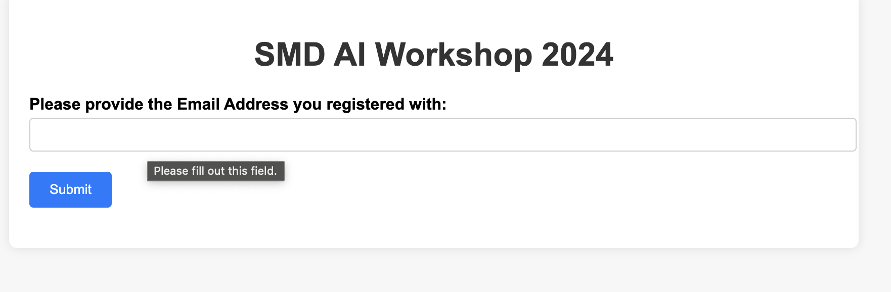
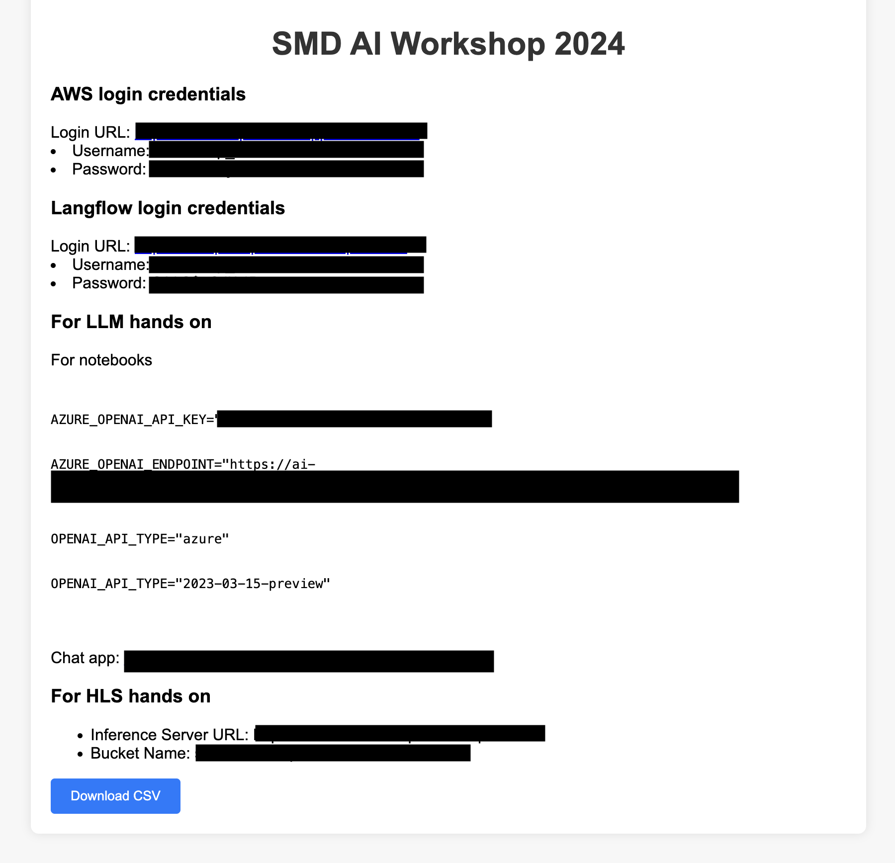
2. Navigate to https://nasa-impact.awsapps.com/start#/ 

3. Log in using the credential provided

4. Navigate to the `Applications` tab
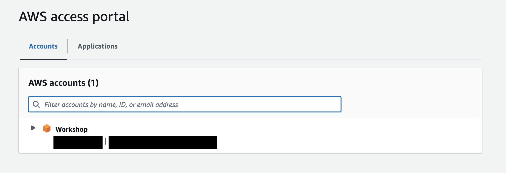
5. Click and open `Amazon SageMaker Studio`
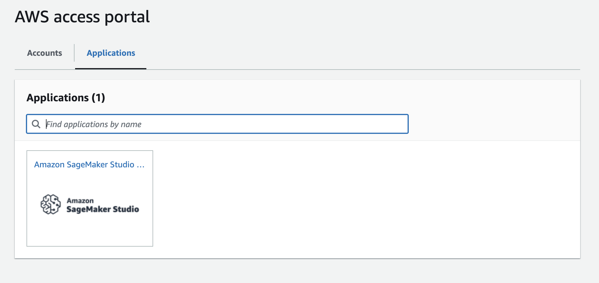
6. Once the Studio starts, Click on JupyterLab
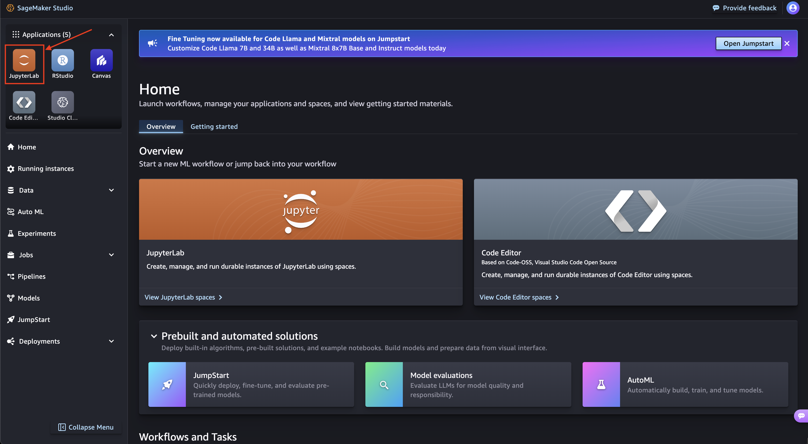
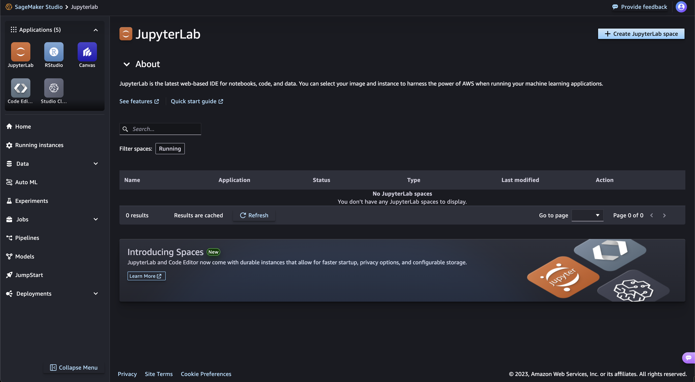
7. Click `Create JupyterLab Space`
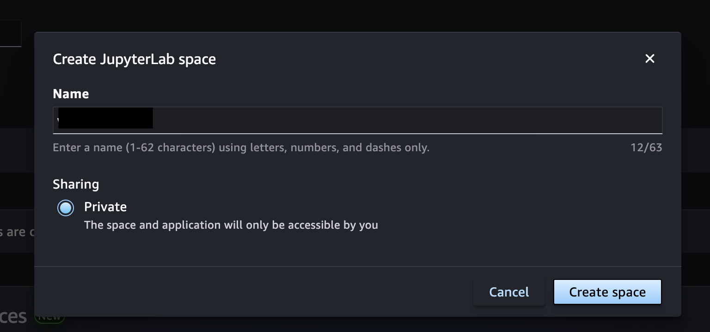
8. Give it a name. Eg: `Workshop`
9. Once initialized, change Instance type to `ml.t3.large` and storage to `50`
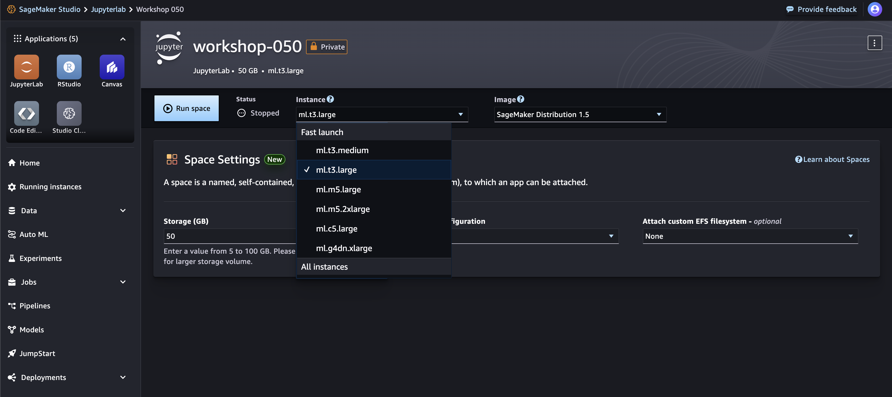
10. Click on `Run Space`. If it throws an error, you might have to pick an Image. The top setting called `Latest` works. 


# Steps to Train (Parts of these steps are also available in the [fine-tuning notebook](notebooks/hls-fm-finteuning.ipynb)):
1. Clone this repository `git clone https://github.com/nasa-impact/smd-llm-workshop.git`
```
a. Click `git`
b. Click on `Git Clone Repo`
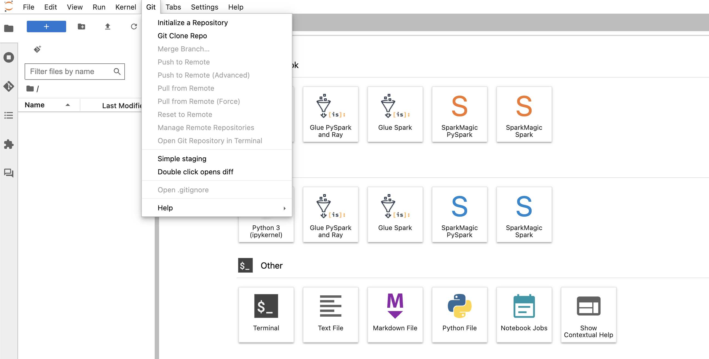
c. Paste `https://github.com/nasa-impact/smd-llm-workshop.git` and Click on `Clone`.
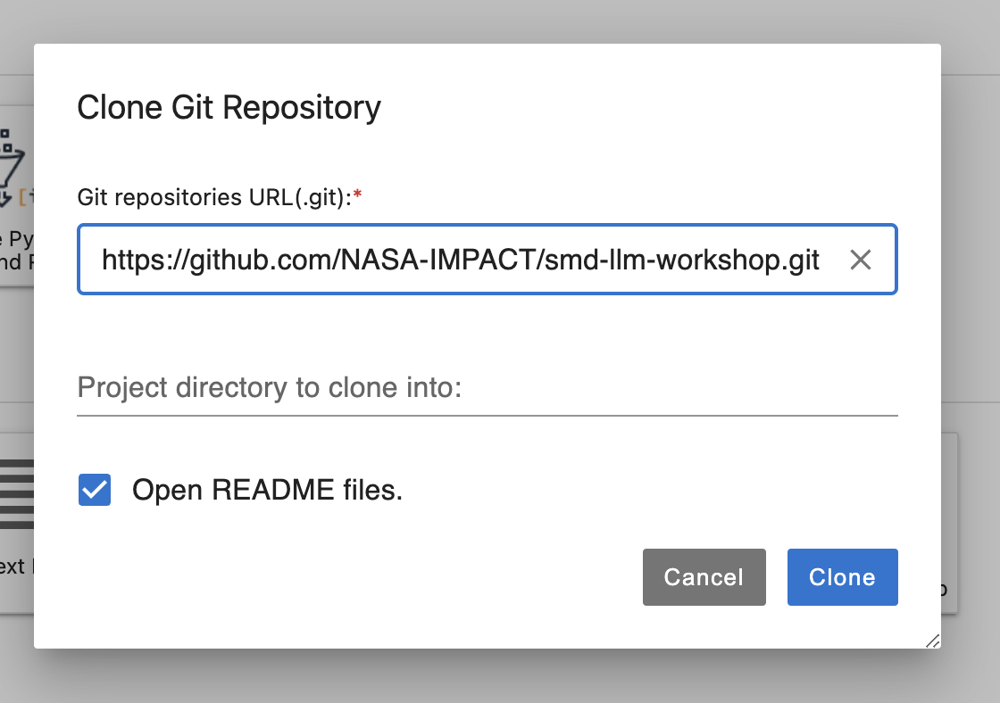
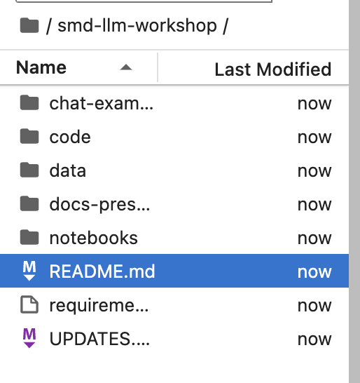
```


# Prompt Engineering for Science

## Introduction

### Fundamental LLM Definitions

**Tokens**

The basic unit of input a LLM uses. It can be a word, part of a word, or some other segment of input. Text is converted to numbers by a tokenizer. Tokens are then used to

- LLMs work with tokens in 3 ways
  - Transform the prompt to tokens
  - Generate the response in tokens
  - Transform the response to human language as an output
- **Context Window**
  - A limit on the number of tokens that an LLM can process in one prompt-completion cycle. Context window limits are likely to increase as LLM research continues.

**Embeddings**

A mathematical representation of words that represent meaning and context. An embedding is essentially a list of numbers for all the dimensions the embedding represents. This list is also called a **vector**.

**Parameters**

There are multiple types of LLM parameters. The types of parameters of interest to this group include:

- **Model Parameters**
  - These parameters indicate the size of the LLM. Model parameters are the parameters of the deep learning neural network that contain the LLM knowledge. LLMs vary in size - larger models do not always equate to better performance.
- **Prompt Parameters**
  - Parameters that can be changed or set during prompting. These can be modified either while using the LLM’s API or via the LLM dashboard. Common prompt parameters include:
    - - Temperature: determines how creative the LLM is when generating a response
        - Number of words: the maximum number of words of the generated response

**Prompting**

A prompt is the instructions provided to an LLM when starting an interaction or making a request. Prompts can be simple questions or a larger set of instructions.

**Fine-Tuning**

Tasks undertaken to potentially improve the behavior of the LLM. Fine-tuning is typically undertaken to overcome prompt engineering limitations.

Reference: Gartner: What Technical Professionals Need to Know About Large Language Models. By Analyst Wilco van Ginkel.

### What is Prompt Engineering?

Prompt engineering is the design and optimization of effective queries or instructions (aka prompt patterns) when using generative AI tools like ChatGPT in order to get desired responses. Understanding how to write prompts will increase the quality of responses received. In other words, ask the right questions to get better answers.

### How to Select an LLM for Your Use Case: Popular LLM Quick Guide

There is no perfect LLM - instead there are LLMs that are appropriate for your use case and your needs. We’ve provided a quick guide of the most commonly used models here for your reference.

| **Model Name** | **\# of Model Parameters** | **Cost** | **Open Source** | **Links** |
| --- | --- | --- | --- | --- |
| GPT-3.5 | 175 billion | Free via chat interface<br><br>Using the API for turbo:<br><br>Input: $0.50 / 1M tokens<br><br>Output: $1.50 / 1M tokens | Closed / Proprietary | <https://openai.com/pricing> |
| --- | --- | --- | --- | --- |
| GPT-4 | \> 1 trillion | Input: $30.00 / 1M tokens Output: $60.00 / 1M tokens | Closed / Proprietary | <https://platform.openai.com/docs/models/gpt-4-and-gpt-4-turbo> |
| --- | --- | --- | --- | --- |
| GPT-4 Turbo | \> 1 trillion | Less expensive than GPT-4<br><br>Input: $10.00 / 1M tokens<br><br>Output: $30.00 / 1M tokens | Closed / Proprietary | <https://platform.openai.com/docs/models/gpt-4-and-gpt-4-turbo> |
| --- | --- | --- | --- | --- |
| LLaMA 2: 7B | 7 billion | N/A | Open | <https://huggingface.co/meta-llama> |
| --- | --- | --- | --- | --- |
| LLaMA 2: 70B | 70 billion | N/A | Open | <https://huggingface.co/meta-llama> |
| --- | --- | --- | --- | --- |
| Mixtral | 7x8 billion | N/A | Open | <https://mistral.ai/news/announcing-mistral-7b/> |
| --- | --- | --- | --- | --- |

### Working with Parameters

Available prompt parameters may vary depending on the interface you are working in. Note that the model that you select may determine the parameters available. Here are some typical parameters you can control along with some definitions:

- Model: The model you want to work with. See the LLM quick guide table for help on selecting a model.
- Temperature: The higher the temperature, the more creative the responses from the model. Typically on a scale of 0 - 2.
- Maximum length: Controls the length of the response from the model and therefore the cost.
- Stop sequences: Tells the model to stop the response after a certain sequence of characters, like a semicolon
- Top P: Controls diversity. Typically on a scale of 0 - 1 where .5 would mean the model has considered half of the available words
- Frequency penalty: Controls the likelihood of repeating the same line verbatim
- Presence penalty: Controls the likelihood of talking about new topics

Reference: Pluralsight course - Getting Started on Prompt Engineering with Generative AI by Amber Israelsen.

### Best Practices for Prompt Engineering

- When creating an initial prompt, begin the prompt with an action verb (Adopt, Create, Summarize, etc…).
- Iteration on the prompt may be required until the output meets your expectations.
- Avoid long sessions. Restart sessions when you need to reset context or want to provide different prompting instructions.
- Do not share sensitive information.
- Privacy: Avoid requesting or including personal information; adhere to privacy and security protocols.
- Like a human, attention can be a problem with larger portions of text or conversations. To manage attention, it helps to break content into smaller sections.
- Misinformation: Reference scientific consensus from credible, peer-reviewed sources. When using RAG patterns, leverage authoritative sources like the Science Discovery Engine index.
- Bias/Fairness: Utilize RAG patterns with authoritative, curated sources for balanced coverage. Verify fairness in citations.
- Ownership/Copyright: Generate original content, respecting copyright laws. When using RAG patterns, leverage authoritative sources like the Science Discovery Engine index and provide proper citations.
- Transparency: Ask the model to explain the reasoning behind AI outputs or use prompts like ‘fact check’ to help verify. When using RAG patterns, leverage authoritative sources like the Science Discovery Engine index and provide proper citations.

# Prompt Patterns for Science

Let's explore some common prompt patterns as templates that can be re-used for various scientific tasks. These patterns are designed to be used as a starting point for prompt engineering, and can be modified to fit the specific needs of the task at hand. To quickly get started in using the patterns, replace the \[placeholders\] with the relevant information for your task.

Reference: White et al. ‘A Prompt Pattern Catalog to Enhance Prompt Engineering with ChatGPT.’ <https://arxiv.org/abs/2302.11382>

# Output Customization

These prompts focus on tailoring or guiding the format, structure or type of output provided by the LLM.

## Recipe Pattern

This pattern provides limits to ultimately output a sequence of steps given some partially

provided “ingredients” that must be provided in a series of steps to achieve a stated goal. This prompt is helpful for tasks when the user knows the desired end result and the ingredients needed to achieve the result but not the detailed steps themselves.

### Recipe Prompt Template

“I am trying to \[complete a task\]. I know that I need \[step A, B, C\]. Please provide a complete sequence of steps. Please fill in any missing steps.”

### Recipe Science Examples

- I am trying to preprocess Landsat 8 Level-1 data. I know that I need to find and download the data. I know that I need to complete georeferencing, conversion to radiance, solar corrections and atmospheric corrections. I know I will use the ENVI software. Please provide a complete sequence of steps. Please fill in any missing steps.
- I am trying to find and download infrared data of the Crab Nebula. I know that I need to identify the various coordinates of the Crab Nebula. I know that I need to search for data across a number of astronomical catalogs. Please provide a complete sequence of steps. Please fill in any missing steps.

### Lessons Learned

- For data workflows, the answers are sufficient but I suspect there may be even more effective ways of finding or working with data that may not be available to ChatGPT.

[Example](/chat-examples/recipe.md)


## Output Automator Pattern

The goal of this pattern is to have the LLM generate a script that can automatically perform any steps it recommends taking as part of its output. The goal is to reduce the manual effort needed to implement any LLM output recommendations.

### Output Automator Prompt Template

Create a script that \[describes the task to be automated\], using \[specific parameters or conditions\]. Output the steps in \[desired format or language\].

### Output Automator Science Examples

- Create a script that automatically compiles and summarizes the number of new planets confirmed in the previous week using the NASA exoplanet archive data. Include data on planet name, host name and discovery method. Output the summary in a CSV format.
- Create a script that uses the HAPI API to store data from the Parker Solar Probe in an array. Output the summary in a JSON format.
- Create a script that automatically compiles and summarizes weekly seismic activity reports from the USGS database, focusing on earthquakes above magnitude 4.0. Include data on location, magnitude, depth, and potential affected areas. Output the summary in a CSV format.

### Lessons Learned

- I can’t validate the scripts at this time. All I can do is check that they seem to make sense and are using the correct access points which they seem to be doing.

[Example](/chat-examples/output_automater.md)

## Persona Pattern

This type of prompt allows the user to specify a point of view or perspective for the LLM to adopt. The pattern allows users to identify what they need help with without knowing the exact details.

### Persona Prompt Template

Respond to my questions about \[a specific topic or issue\] as if you are \[specific profession\].

### Persona Prompt Science Examples

- Respond to my questions about gravitational waves as if you are an expert astrophysicist.
- Respond to my questions about the formation of gas planets as if you are an expert planetary scientist.
- Respond to my questions about the effects of spaceflight on life as if you are an expert space biologist.

### Lessons Learned

- When I asked this: “Respond to my questions about gravitational waves as if you are an expert astrophysicist. Explain the processes involved from your expert perspective,” I got a super long paragraph with no interaction. Sometimes I would get an interactive experience, other times I would not. It was not consistent.
- Given ChatGPT’s reading/writing level, the responses are not always in the technical language you would expect of a scientist. For example, in the astrophysics example, the description of how an interferometer works is mostly correct (I think) but not in the language of a scientist working in that field. However, I still found the explanation of how GW data is validated and how multi-messenger astronomy works helpful for someone trying to get a basic understanding of it.

[Example](/chat-examples/persona.md)

# Interaction

These prompts help control the interaction between the user and the LLM.

## Flipped Interaction

The flipped interaction pattern switches the typical interactions so that the LLM is asking the user questions instead of the user. The interaction should drive the conversation towards a goal. This pattern allows the LLM to use its knowledge to more accurately obtain information from a user. The prompt should always specify the goal of the interaction so that the LLM can understand what it is trying to accomplish.

### Flipped Interaction Prompt Template

"Instead of explaining directly, ask me a series of questions one by one about \[specific topic or concept\] to help me understand the concept better."

### Flipped Interaction Prompt Science Examples

- Instead of explaining directly, interact with me by asking me a series of questions one by one about star formation to help me understand the concept better.
- Instead of explaining directly, interact with me by asking me a series of questions one by one about space weather to help me understand the concept better.

### Lessons Learned

- When asking this - “Instead of explaining directly, ask me a series of questions one-by one about star formation to help me understand the concept better,” it just asked the questions and gave me no feedback as to whether my answers were correct.
- Whenever I prompt this - “Instead of explaining directly, ask me a series of questions about star formation to help me understand the concept better,” it will sometimes just provide a list of 10 questions instead of walking me through the questions.

[Example](/chat-examples/flipped-interaction.md)

# Prompt Improvement

These prompts focus on improving the quality of both the input and the output.

## Question Refinement Pattern

This pattern leverages the LLM to make the prompt engineering process better. The prompt allows the LLM to help the user ask better questions.

### Question Refinement Prompt Template

"Refine my question about \[original topic or question\] to make it more specific and clear, focusing on \[desired aspect or detail\]."

### Question Refinement Science Examples

- Refine my question about how lightning forms to make it more specific and clear, focusing on the role of ice particles.
- Refine my question about how spaceflight affects organisms to make it more specific and clear, focusing on how spaceflight affects genes.

### Lessons Learned

- Sometimes after ChatGPT would write a better question for me, I would copy and paste the question back into the chat to get the answer. Often it would comment on the clarity of the question as opposed to answering the question itself. If I was more specific and said: “Answer the following question: …..” it would then answer the question for me.

[Example](/chat-examples/question-refinement.md)

## Alternative Approach Pattern

This prompt allows the LLM to provide alternative approaches to accomplishing a task.

### Alternative Approach Prompt Template

Provide different approaches to solve \[specific problem or task\], considering various data, methods, tools, or algorithms that could be applied.

### Alternative Approach Science Examples

- Provide different approaches to studying the Earth from space, considering various methods, tools, or perspectives that could be applied.
- Provide different approaches to detecting exoplanets, considering various data, methods, tools, or algorithms that could be applied.
- Provide different approaches to determining Earth's surface reflectance, considering various data, methods, tools, or algorithms that could be applied.

### Lessons Learned

[Example](/chat-examples/alternative-approach.md)

## Cognitive Verifier Pattern

LLMs often perform better when using a question that is subdivided into individual questions. This prompt forces the LLM to break questions down into additional smaller questions.

### Cognitive Verifier Prompt Template

For the question '\[initial question\]', suggest a series of sub questions to help explore and understand the various aspects of this topic, leading to a more informed and comprehensive answer.

### Cognitive Verifier Science Examples

- For the question 'what happens during a total solar eclipse?', suggest a series of subquestions to help explore and understand the various aspects of this topic, leading to a more informed and comprehensive answer.
- For the question 'what are emerging research areas in astrophysics?', suggest a series of subquestions to help explore and understand the various aspects of this topic, leading to a more informed and comprehensive answer.

### Lessons Learned

- This one seems to work well and is fairly straightforward.

[Example](/chat-examples/cognitive-verifier.md)

# Error Identification

These prompts help you identify and resolve errors that may be in the output generated by the LLM.

## Fact Check List Pattern

This pattern is meant to ensure that the model provides a list of facts that are present in the output in order to help inform the user of the facts the output is based on. The user can then leverage the list of facts to validate the output.

### Fact Check List Prompt Template

From now on, when you generate an answer, create a set of facts that the answer depends on that should be fact checked and list this set of facts at the end of your output.

### Fact Check List Science Examples

- From now on, when you answer a question, create a set of facts that the answer depends on that should be fact checked and list this set of facts at the end of your output. How does space weather affect Earth?
- From now on, when you answer a question, create a set of facts that the answer depends on that should be fact checked and list this set of facts at the end of your output. What causes the greenhouse gas effect on Venus?

### Lessons Learned

- I could use the fact list to ask follow up questions. ChatGPT then provided facts for the answer to the follow up question.
- Adding the ‘only include the facts related to \[x\] didn’t really work for me and doesn’t seem to be terribly helpful anyways.
- I’m not 100% sure that I would call this a ‘fact list’ so much as a list of follow up questions for the model or a list of keywords that can be used to search in Google.

[Example](/chat-examples/fact-check.md)

# Context Control

These prompts focus on controlling the contextual information that the LLM uses.

## Context Manager Pattern

This pattern allows users to specify or remove context for a conversation with an LLM. The goal is to focus the conversation on specific topics or exclude topics from the conversation.

### Context Manager Prompt Template

When explaining/studying \[topic\], only include information on \[specific sub-topic\]. Ignore \[alternative sub-topic\].

### Context Manager Science Examples

- When explaining how exoplanets are detected, only include information on the gravitational lensing method. Ignore the transit method.
- When explaining how lightning works, only include information on lightning that results from volcanic eruptions. Ignore lightning that occurs during atmospheric weather events.
- When studying the greenhouse gas effect, consider the greenhouse gas effect on Venus. Please ignore the greenhouse effect on Earth.

### Lessons Learned

- I tried a lazy prompt like this one ->”When explaining how exoplanets are detected, ignore the transmit method.” <- and did not get a good response. It still included the transit method. So a little structure is required.

[Example](/chat-examples/context-manager.md)

# Putting It All Together: Combining Prompt Patterns

The prompt patterns described above can be combined to complete more complex tasks. For this example, the Persona, Recipe and Output Automator prompt patterns will be combined to help you create either a requirements document or a procedure plan related to scientific data governance and management.

This activity uses the [Modern Scientific Data Governance Framework (mDGF)](https://github.com/NASA-IMPACT/modern-dgf/tree/main) to help you easily answer questions about government mandates and organizational policies related to scientific data management. You will also be able to use the prompt to create either a requirements document or a procedure plan informed by the mDGF. The goal of this activity is to make it easier to develop a plan to implement what is needed to be compliant with policies and procedures.

## mDGF Prompt

You are an expert in scientific data governance and management and you will assist the users by answering questions and creating documents. Use only the content in the Modern Data Governance Framework (MDGF) reference text after the delimiter for your answers. If a questions falls outside the reference text, then respond, “This is out of scope for me to answer”

Your responsibilities are two::

First - Answering Questions:

- You will be asked questions. Answer the question only using the reference text provided.
- Cite the passage from the document used to answer the question, prefixing it with citation.
- If you cannot find an answer in the reference text, then respond, “I could not find the answer”

Second - Creating Documents:

When asked by a user to create either a requirements document or a procedure plan based on the reference text. Assist the use by asking a series of questions to capture their project needs. Capture the user needs in a JSON format with the keys: Entities/Assets, Governance Activities, Type.

Step 1: Identify the entities in the user’s project. Respond with: “Sure, I will be happy to help. First tell me the core entities or assets in that you will be managing”

Core entities or assets

- Data
- Metadata
- Digital content
- Code
- Software

Step 2: Identify governance activities in the user’s project. Respond with: “Tell me about the governance activities need in your project”

Governance activities

- Planning and Design
- Monitoring
- Generation/Curation
- Sharing
- Use/Reuse
- Preservation

Step 3: Identify the user's need for the Type of document. Respond with: “Are you seeking Requirements or Procedures for your project?”

Type

- Requirements
- Procedures

[Notebook Example](/notebooks/Chat-with-mDGF.ipynb)

# Creating Quick Prototype Applications Using LangFlow

## Goals

The goal of this activity is to demonstrate rapid prototyping with LangFlow using a RAG chatbot for the [Open Science Data Repository](https://osdr.nasa.gov/bio/index.html) (OSDR). The OSDR provides open access to NASA’s space biology data including GeneLab and the Ames Life Sciences Data Archive (ALSDA). Being able to ask questions about space biology data will help scientists understand how the fundamental building blocks of life itself – DNA, RNA, proteins, and metabolites – change from exposure to microgravity, radiation, and other aspects of the space environment.

## Approach

For this activity, we will leverage trusted and curated NASA SMD resources from the [Science Discovery Engine](https://sciencediscoveryengine.nasa.gov/app/nasa-sba-smd/#/home) (SDE) index in order to create a topical chatbot focused on the OSDR. We will utilize prebuilt Lang Flow components for SMD, requiring minimal configuration.

## Value

For scientists, having the ability to facilitate direct interactions with authoritative domain-specific resources will help streamline workflows to make the research process more efficient.

For data stewards, this activity will highlight the benefits of using curated SDE resources for chatbot development.

## Implementation Steps

1. Begin with existing workflow templates for speed and efficiency.
2. Customize the SDE retriever to focus on specific topics or themes.
3. Engage with the chatbot through the chat interface or a Python interface for versatility.

## Background Information

### Lang Flow Overview

LangFlow is a tool designed for rapid experimentation and prototyping with LangChain, providing a graphical user interface (GUI) that utilizes react-flow technology. It offers a drag-and-drop feature for easy prototyping and a built-in chat interface for real-time interaction. LangFlow allows users to edit prompt parameters, create chains and agents, track thought processes, and export flows. This modular and interactive design aims to foster creativity and streamline the creation process for dynamic graphs where each node is an executable unit​.

### PromptLab

Promptlab is a modified and managed LangFlow instance developed by the IMPACT ML-and-Dev team, which further adds functionality that simplifies the creation and sharing of LLM workflows. It also has custom connectors that leverage SDE as a source of documents for Retrieval Augmented Generation as well as predefined workflows for quick adaptation and re-use.

# Enhancing Data Discovery with LangChain: Earth Science & Astrophysics Examples

## Goals

The goals of this activity are to teach developers to create applications using LLMs that enable users to effortlessly query Earth Science or Astrophysics datasets and observations using natural language queries.

Both Earth scientists and astrophysicists need to complete advanced spatiotemporal searches to find focused data or observations. Earth scientists search for data about a specific phenomenon in a certain region over a specific period of time. For example, I want to find ozone data in the Los Angeles area in the year 2005. Astrophysicists search for data or observations about or around a specific object in space. For example, I want to find data within 1 arcminute of the Southern Ring nebula. Users new to astrophysics may want to know the cross identifications of an object in space while advanced users may want to search for publications about an object using associated bibcodes.

For Earth science searches, we will use the [Common Metadata Repository (CMR)](https://cmr.earthdata.nasa.gov/search/site/docs/search/api.html) to search for data. For astrophysics searches, we will use several services from [Astroquery](https://astroquery.readthedocs.io/en/latest/) (SIMBAD, ADS, etc…) to search for data and information.
[Example 1: CMR](/notebooks/langchain-react-cmr.ipynb)
[Example 2: Astro](notebooks/langchain-react-astro.ipynb)

## Approach

For this activity we will adopt the LangChain framework for integration of existing data and information systems. We will implement ReACT pattern orchestration for dynamic interaction.

## Value

For scientists, advanced search capabilities will streamline data access workflows, making science more efficient and scalable.

For data stewards, these advanced search capabilities will increase data utilization and reusability.

## Implementation Steps

1. Identify and define LLM-compatible tools for enhanced query handling.
2. Employ ReACT patterns for structured data interaction and response.
3. Implement quantitative validations to ensure accuracy and reliability.

## Background Information

LangChain is an open-source framework for building applications based on large language models (LLMs). It provides tools to help LLMs generate more accurate and relevant information by chaining together models, prompt patterns, and information stores to optimize the generation process. Langchain is the underlying framework that powers Langflow/promptlab and is designed to be used by developers as a standalone tool for building and deploying AI applications.

# Fine-Tuning the NASA SMD Encoder Model

## Goal

The goal of this activity is to modify an existing LLM to aid in scientific thematic data curation.

The sheer amount of scientific data and information available can be overwhelming and confuse anyone, especially those new to research or those delving into a new discipline. Leveraging an LLM to curate relevant data and information around a topic can help streamline the [scientific curation process.](https://eos.org/features/the-art-of-scientific-curation)

For this activity, we will curate data related to [Environmental Justice indicators](https://www.earthdata.nasa.gov/learn/environmental-justice-data-catalog) in order to help build a focused search application within the Science Discovery Engine.

## Approach

Use the SMD Encoder model and training (labeled) data to train a classifier.

## Value

For scientists, thematic search applications enables the discovery of new, research-relevant datasets.

For data stewards, the ability to quickly provide thematic, focused search portals in the Science Discovery Engine will increase data discovery and use. In addition, LLMs augment and streamline the current manual curation processes, making it more efficient.

## Implementation Steps

1. Begin with fine-tuning the Encoder Model.
2. Conduct comparative analysis with the Decoder Model.
3. Explore results against One-Shot and Few-Shot learning methods.
4. Perform quantitative evaluation to measure classifier performance.

## Background Information

Fine tuning a language model is the process of training a pre-trained language model on a specific dataset to create a custom model that is tailored to a specific task. Fine-tuning an encoder model is different from fine-tuning a decoder model both in terms of the process and the use cases they are best suited for.

### Fine Tuning an Encoder Model

An encoder LLM model is fine-tuned by connecting task-specific layers to the pre-trained model and training the entire model on a task-specific dataset. This process is best suited for tasks that require the model to generate structured outputs based on the input, such as text classification, named entity recognition, and text summarization. These models are best performing when they are used as part of a larger pipeline, where the model's output is used as input to another model or system. e.g. sentence transformer, text classification, named entity recognition, text summarization.

[Notebook Example](/notebooks/EJ Classify.ipynb)

### Fine Tuning a Decoder Model

A decoder LLM model is fine-tuned by providing the model with task-specific examples and training it to generate outputs that are relevant to the task. This process is best suited for tasks that require the model to generate free-form text based on the input, such as question answering, text generation, and dialogue systems and function calling. These models are best performing when they are used as standalone systems, where the model's output is the final output of the system. while fine tuning the decoder model end-to-end is prohibitively expensive and destroys the connections learned during pre-training, it is possible to fine-tune the model using low-rank adaptation (LoRA) techniques, in which only a small subset of the model's parameters are updated during training, there-by reducing the computational cost of fine-tuning the model, as well as preserving the model's original capabilities.

[Notebook Example](/notebooks/EJ-metadataextraction.ipynb)
